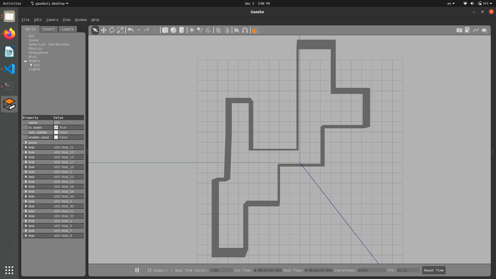

# Gazebo World and Models

## Overview
This repository contains a custom Gazebo simulation environment and its associated models. The world is designed for testing autonomous navigation, robot manipulation, or delivery scenarios. It includes carefully crafted models in **SDF (Simulation Description Format)** to represent various objects and environments.

## Features
- **Custom World**: A city-like environment with roads, buildings, and intersections.
- **SDF Models**: Includes detailed models of a table, a chair, and a human-like stand.
- **Realistic Physics**: Accurate physics for simulating collisions, friction, and dynamics.
- **Integration**: Compatible with ROS and Gazebo.


## File Structure
- **b55/**  
    

- **hebab/**  
    

- **person_walking/**  
    
  A dynamic model simulating a person walking. can be used with camera in simulation world as it detects the human.


- **rest/**  
    
  Another set of models for resting areas.

- **yarab/**  
    

- **yarab_yarab/**  
    
  Extensions or variants of the 'yarab' models.

- **Worlds/**: Contains multiple simulation environments in `.world` format.
  - **rest.world**  
      
    A flat terrain for basic navigation testing.
  
  - **walk_foward.world**  
    Actor walking foraward in plain world

  - **world_test.world**  
      

  - **walk.world**  
      
    
## How to Use
1. **Load Models**:
   - Copy the desired model folder into your Gazebo `models` directory.
   - Use the images in the **Data/** folder to preview models before selecting them.

2. **Load Worlds**:
   - Place `.world` files into your Gazebo workspace and launch them using:
     ```bash
     gazebo Worlds/<world_name>.world
     ```
3. **Load the world with the launch file if needed**

```bash
  <!-- Include the Gazebo launch file with the custom world -->
  <include file="$(find gazebo_ros)/launch/empty_world.launch">
    <arg name="world_name" value="$(find delivery_robot)/worlds/rest.world"/>

```
