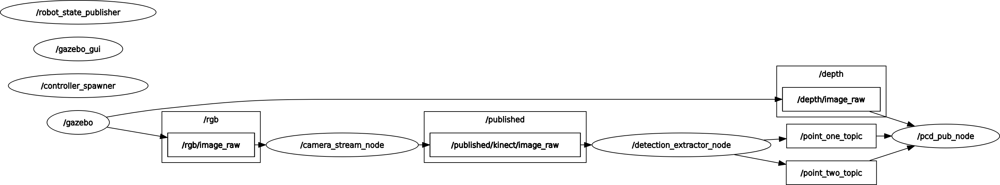

# Kinect Camera Simulation Package

## Overview
This package simulates a Kinect camera to detect objects using Single Shot MultiBox Detector (SSD) and retrieves point cloud data (PCD) for the detected objects' bounding box areas. The simulation is done in a ROS (Robot Operating System) environment, leveraging Gazebo for the simulation.

## Features
- Simulates Kinect camera in Gazebo.
- Object detection using SSD.
- Extracts point cloud data from the bounding box area of detected objects.

## Requirements
- ROS Noetic
- Gazebo
- SSD implementation (SSD MobileNet or FastSAM)
- OpenCV
- PCL (Point Cloud Library)
- Python 3

## Installation
1. **Clone the repository:**
   ```bash
   git clone <repository_url>
   cd <repository_name>
   ```

2. **Install the necessary dependencies:**
   ```sh
    sudo apt-get update
    sudo apt-get install ros-noetic-desktop-full ros-noetic-pcl-ros python3-opencv
    pip3 install -r requirements.txt
   ```


3. **Build the package:**
   ```bash
    cd ~/catkin_ws
    catkin_make
    source devel/setup.bash
   ```
## Usage
1. **Launch the Simulation**
To start the simulation with the Kinect camera:
``` bash
roslaunch <your_package_name> camera_stream_sim.launch
```
2. **Object Detection**
The SSD-based object detection node can be started as follows:
```bash
rosrun <your_package_name> camera_sub_sim.py
```

3. **Point Cloud Data Extraction**
Then extract point cloud data for the bounding box areas

the sequence appears like the photo 


## Nodes

- **Kinect Camera Node**

Topic:

    /camera/rgb/image_raw - The raw image from the Kinect camera.
    /camera/depth/points - The point cloud data from the Kinect camera.

- **SSD Detection Node**

Description: Detects objects in the RGB image using SSD.
Subscribed Topics:

    /camera/rgb/image_raw
    Published Topics:
    /detection/bounding_boxes - Detected bounding boxes.

- **PCD Extraction Node**

Description: Extracts point cloud data for the detected bounding boxes.
Subscribed Topics:

    /camera/depth/points
    /detection/bounding_boxes
    Published Topics:
    /detection/pcd - Point cloud data for the detected bounding boxes.
