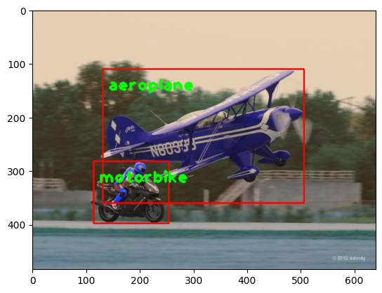
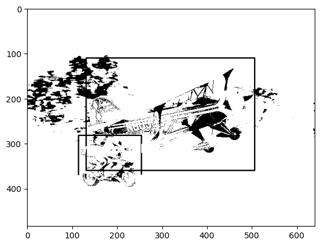

# Single Shot MultiBox Detector (SSD) for Object Detection

## Introduction

This project implements the Single Shot MultiBox Detector (SSD) for real-time object detection. SSD is a popular object detection framework that discretizes the output space of bounding boxes into a set of default boxes over different aspect ratios and scales per feature map location.

## Features

- Real-time object detection
- Supports multiple classes
- Utilizes pre-trained weights for quick deployment
- Configurable network architecture
- ROS integration for real-time data processing and publishing

## Requirements

- Python 3.6+
- PyTorch
- OpenCV
- ROS (Robot Operating System)
- NumPy

## Installation

1. **Clone the repository:**

    ```sh
    git clone https://github.com/your-username/ssd-object-detection.git
    cd ssd-object-detection
    ```

2. **Install dependencies:**

    ```sh
    pip install -r requirements.txt
    ```

3. **Set up ROS environment:**

    Ensure that ROS is installed and properly set up on your system. Follow the official [ROS installation guide](http://wiki.ros.org/ROS/Installation) if needed.

## Pre-trained Weights

Download the pre-trained weights from [this link](#) and place them in the `weights/` directory.

## Usage

### Training

To train the SSD model on your custom dataset, follow these steps:

1. **Prepare your dataset:**

    Ensure your dataset is in the correct format (e.g., VOC, COCO). Modify the dataset loader script if necessary.

2. **Train the model:**

    ```sh
    python train.py --dataset YOUR_DATASET_PATH --batch_size 32 --epochs 100
    ```

### Inference

To run inference using the pre-trained SSD model, use the following command:

```sh
python inference.py --image path_to_your_image.jpg
```
## Results
<p align="center">
  
  
</p>

## ROS Integration
To integrate SSD with ROS for real-time object detection, follow these steps:

1. Set up ROS nodes \
Create a new ROS package and add the (python file name).py script to your package. Ensure all dependencies are listed in your package.xml.

2. Run the ROS node 
```sh
rosrun your_ros_package ssd_ros.py
```
3. Publishing and Subscribing
- The script subscribes to an image topic (/camera/image_raw).the name topic could vary from one to another.
- Detected objects are published to a topic (e.g., /ssd/detections).

## Acknowledgments
This implementation is based on the original paper "SSD: Single Shot MultiBox Detector" by Liu et al. and leverages the PyTorch framework. Special thanks to the open-source community for providing valuable resources and pre-trained models.

## References
- [SSD: Single Shot MultiBox Detector](https://arxiv.org/abs/1512.02325)
- [PyTorch](https://pytorch.org/)
- [OpenCV](https://opencv.org/)
- [ROS (Robot Operating System)](http://wiki.ros.org/)
